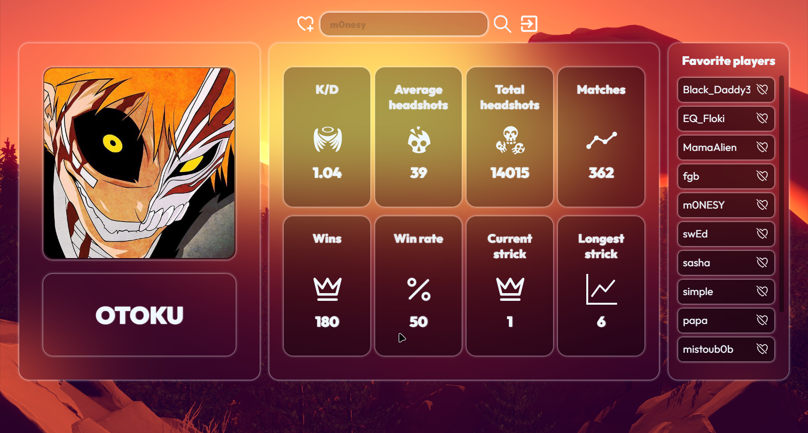
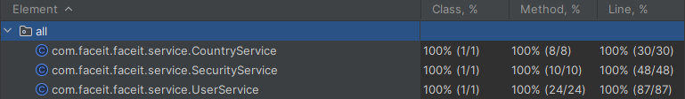

[](https://sonarcloud.io/summary/new_code?id=k9targex_FaceitApi) 
[](https://sonarcloud.io/summary/new_code?id=k9targex_FaceitApi) 
[](https://sonarcloud.io/summary/new_code?id=k9targex_FaceitApi) 
[](https://sonarcloud.io/summary/new_code?id=k9targex_FaceitApi)

# <center>Faceit API</center>

## About the Project

**Faceit API** is a project that leverages JWT tokens, CQRS, and Spring Security to provide a streamlined method for retrieving player statistics in **Counter-Strike 2: Global Offensive 2** using the Faceit API. Faceit is a premier platform for playing multiplayer online games such as Counter-Strike: Global Offensive, Dota 2, and others.

<p align="center">
  
</p>

## Key Features

- **PostgreSQL Integration**:
  - PostgreSQL is used for persisting user data and their favorite players.

- **React Frontend**:
  - The frontend of the application is built using **React** to provide a dynamic and responsive user interface.

- **Spring Framework Backend**:
  - The backend is developed with **Spring Framework**, which offers a robust and flexible structure for building enterprise-grade applications.

- **Maven Build System**:
  - **Apache Maven** is used as the build automation tool, ensuring that the project is consistently compiled, packaged, and managed.

- **Responsive Design**:
  - The application is built with a responsive design using **media queries** and **CSS Grid Layout** to ensure optimal display across all devices, from mobile phones to desktops.

- **Favorites Management**:
  - Users can add and remove players from their favorites list. This feature enhances user engagement by allowing them to keep track of players they are interested in.

- **Security and Authentication**:
  - The project utilizes **Spring Security** for managing user authentication and authorization via **JWT tokens**. These tokens are configured with **HttpOnly** and **Secure** flags to enhance security by ensuring they are accessible only by the server and transmitted over secure connections (HTTPS).

- **Custom Error Handling**:
  - A custom error handler ensures consistent management of exceptions and errors across the application, maintaining a smooth user experience and safeguarding sensitive information.

- **Logging and Monitoring**:
  - Comprehensive logging tracks user actions and system events, facilitating detailed monitoring and auditing, which are critical for maintaining security and performance.

- **Caching**:
  - Caching is implemented to improve performance by reducing the load on external APIs and databases. Frequently accessed data is stored locally, leading to faster retrieval and better user experience.

## Unit Tests

- **Comprehensive Testing**:
  - All business logic in the application is covered by unit tests, ensuring high reliability and reducing the risk of bugs or regressions. This 100% unit test coverage is a testament to the robustness and quality of the codebase, making the application highly dependable.

<p align="center">
  
</p>

## Installation and Running

1. Clone the repository to your local machine:

    ```bash
    git clone https://github.com/k9targex/FaceitApi.git
    ```

2. Ensure you have Apache Maven version 3.9.6 or higher installed.

3. Open your command prompt or terminal and navigate to the project's root directory.

4. Execute the following commands:

    ```bash
    mvn clean install
    java -jar target/Faceit-0.0.1-SNAPSHOT.jar
    ```

   These commands will clean the project, compile, and package it into a JAR file. The application will be available at [http://localhost:8080](http://localhost:8080).

## Usage

### Home Page

1. Navigate to [http://localhost:8080](http://localhost:8080) in your web browser.

2. Enter the player's nickname in the input field and click the button to retrieve statistics.

3. The application will fetch the player's statistics from the Faceit API and display them on the page.

### Example

To retrieve statistics for a player with the nickname "s1mple":

1. Go to [http://localhost:8080](http://localhost:8080).

2. Enter "s1mple" in the input field and click the button.

3. You will see the player's statistics, fetched directly from the Faceit API.
