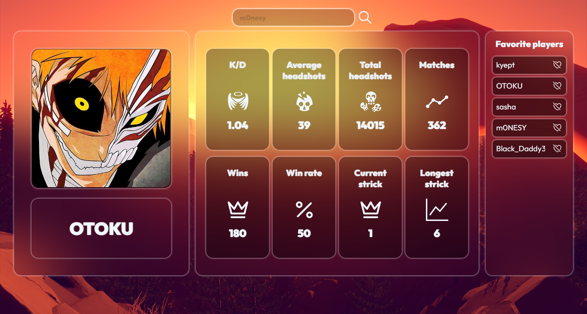

# <center>Faceit Api</center>

## About the Project

Faceit Api is a project that provides a simple way to retrieve player statistics in Counter-Strike: Global Offensive using the Faceit API. Faceit is one of the leading platforms for playing multiplayer online games such as Counter-Strike: Global Offensive, Dota 2, and others.
<p align="center">
  
</p>

## Installation and Running

1. Clone the repository to your local computer:

    ```
    git clone https://github.com/k9targex/FaceitApi.git
    ```

2. Ensure you have Apache Maven version 3.9.6 or higher installed.

3. Open the command prompt or terminal and navigate to the project's root directory.

4. Execute the following commands:

    ```
    mvn clean install
    java -jar target\Faceit-0.0.1-SNAPSHOT.jar
    ```

   These commands will clean the project, compile and package it into a JAR file, and run the application at [http://localhost:8080](http://localhost:8080).

## Usage

### Home Page

1. Go to [http://localhost:8080](http://localhost:8080) in your web browser.

2. Enter the player's nickname in the input field and click the button to retrieve statistics.

3. The application will send a request to the Faceit API to retrieve the player's statistics and display them on the page.

### Example

Suppose you want to get statistics for a player with the nickname "s1mple".

1. Go to [http://localhost:8080](http://localhost:8080).

2. Enter "s1mple" in the input field and click the button.

3. You will see the statistics for the player "s1mple" provided by the Faceit API.
